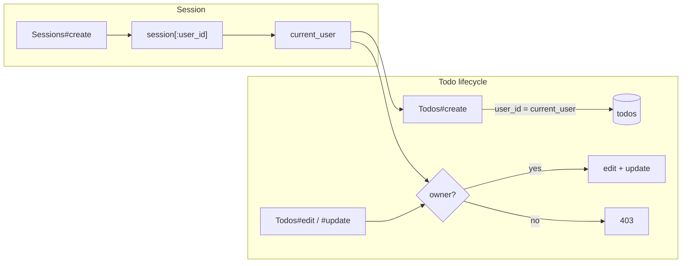

# Homework 5 - Submission

## Artifact links

| Artifact | Link |
|----------|------|
| **GitHub Classroom hw5 repository** (`main`) | [homework-5-FuturrCoder](https://github.com/NU-CS-Software-Studio-Spring-26/homework-5-FuturrCoder) · [tree/main](https://github.com/NU-CS-Software-Studio-Spring-26/homework-5-FuturrCoder/tree/main) |
| **`.cursorignore`** | [.cursorignore](https://github.com/NU-CS-Software-Studio-Spring-26/homework-5-FuturrCoder/blob/main/.cursorignore) |
| **`AGENTS.md`** | [AGENTS.md](https://github.com/NU-CS-Software-Studio-Spring-26/homework-5-FuturrCoder/blob/main/AGENTS.md) |
| **`.cursor/rules/rails-conventions.mdc`** | [rails-conventions.mdc](https://github.com/NU-CS-Software-Studio-Spring-26/homework-5-FuturrCoder/blob/main/.cursor/rules/rails-conventions.mdc) |
| **`.cursor/rules/security.mdc`** | [security.mdc](https://github.com/NU-CS-Software-Studio-Spring-26/homework-5-FuturrCoder/blob/main/.cursor/rules/security.mdc) |

---

## Part 3 - Ask mode

### Prompt used

> Where in this codebase is todo editing currently implemented? Cite the exact files and line numbers. Do not propose changes.

### File paths and line numbers Cursor returned

- `config/routes.rb` - lines 2 - real
- `app/controllers/todos_controller.rb` - lines 2, 18-20, 37-48, 69-76 - real
- `app/views/todos/edit.html.erb` - lines 1-12 - real
- `app/views/todos/_form.html.erb` - lines 1-22 - real
- `app/views/todos/show.html.erb` - lines 5-6 - real
- `app/views/todos/index.html.erb` - lines 7-14 - real
- `app/views/todos/_todo.html.erb` - lines 1-7 - real
- `app/views/todos/show.json.jbuilder` - line 1 - real
- `app/views/todos/_todo.json.jbuilder` - line 1 - real
- `app/models/todo.rb` - lines 1-2 - real
- `test/controllers/todos_controller_test.rb` - lines 31-39 - real
- `test/system/todos_test.rb` - lines 24-33 - real

---

## Part 3 - Plan mode

### Prompt used

> I want to change todo editing so that only the user who created a todo can edit it. Propose a plan as a numbered list of changes, including files to edit, new tests to add, and any migration. Do not write code.

### Plan returned (I edited it by removing step 11):

\# Creator-only todo editing

\## Context

Today, todos have no owner (`db/schema.rb` — only `description`, `due_date`, timestamps) and there is no authentication (`AGENTS.md`, `app/controllers/application_controller.rb`). Edit/update are open in `app/controllers/todos_controller.rb` (`edit` L18–20, `update` L37–48) with a public link on `app/views/todos/show.html.erb` L6.

You chose User + bcrypt + session login (uncomment existing `bcrypt` in `Gemfile` L20–21 — not a new gem).



Scope: Restrict edit and update only (not destroy/show/index). Require sign-in to create todos so every todo has a creator. Non-owners may still view todos.

HTTP behavior: Unauthorized `edit`/`update` → `403 Forbidden` (HTML and JSON), not a silent redirect.

---

\## Numbered changes

\### 1. Enable bcrypt

- Edit `Gemfile`: uncomment `gem "bcrypt", "~> 3.1.7"`.
- Run `bundle install` (updates `Gemfile.lock`).

\### 2. Migrations

2a. Create users — `bin/rails generate migration CreateUsers email:string:uniq password_digest:string`

- `email`: `null: false`, unique index.
- `password_digest`: `null: false`.
- Reversible `change` migration.

2b. Add creator to todos — `bin/rails generate migration AddUserToTodos user:references`

- `user_id`: foreign key to `users`, `null: false`.
- For existing rows in dev/test: in the same migration (or a follow-up data migration), assign a default user (e.g. create `User` with sample email/password in migration `up` only, or backfill from seeds after migrate). Test DB is rebuilt from fixtures, so fixtures matter more than prod backfill.
- Run `bin/rails db:migrate` (regenerates `db/schema.rb`).

\### 3. Models

- New `app/models/user.rb`:
  - `has_secure_password`
  - `has_many :todos, dependent: :destroy` (or `:restrict_with_error` if you prefer orphans impossible)
  - Validations: `email` presence, uniqueness, format (simple).
- Edit `app/models/todo.rb`:
  - `belongs_to :user`
  - Optional: `validate :user, presence: true` (redundant if DB `null: false`).

\### 4. Session / current user (controller layer)

- Edit `app/controllers/application_controller.rb`:
  - `helper_method :current_user, :logged_in?`
  - `current_user` from `session[:user_id]` → `User.find_by(id: ...)`
  - `require_login` — redirect HTML to login with flash; JSON `401` if no session (used on `create`, not on public `show`/`index`).
- New `app/controllers/sessions_controller.rb`:
  - `new`, `create` (authenticate by email/password, set `session[:user_id]`), `destroy` (clear session).
  - Strong params via `params.expect` for email/password (match project convention).
- New `app/controllers/users_controller.rb` (minimal):
  - `new`, `create` for sign-up (sets session on success).
  - Or combine sign-up into sessions — either is fine; sign-up is needed so tests/users exist.

\### 5. Todo controller authorization

- Edit `app/controllers/todos_controller.rb`:
  - `before_action :require_login, only: %i[new create]` (and optionally `edit update` if you want login required before owner check).
  - `before_action :authorize_todo_owner!, only: %i[edit update]`.
  - `authorize_todo_owner!`: if `current_user` is nil or `current_user != @todo.user` → `head :forbidden` (both formats) or `render` a simple forbidden template for HTML.
  - `create`: build with `current_user.todos.build(todo_params)` (do not permit `user_id` in `todo_params` in `app/controllers/todos_controller.rb` L74–76).
  - Keep `respond_to` HTML + JSON only; no turbo_stream.

\### 6. Routes

- Edit `config/routes.rb`:
  - `resource :session, only: %i[new create destroy]` (or `sessions` plural — pick one and stay consistent).
  - `resources :users, only: %i[new create]` for registration.
  - Keep `resources :todos` as-is.

\### 7. Views

- New `app/views/sessions/new.html.erb` — login form (email, password).
- New `app/views/users/new.html.erb` — sign-up form.
- Edit `app/views/layouts/application.html.erb` — show current user email + Log out / Log in links.
- Edit `app/views/todos/show.html.erb` L5–7 — wrap “Edit this todo” in `if logged_in? && current_user == @todo.user` (or a small helper `can_edit?(@todo)` in `ApplicationHelper`).
- Edit `app/views/todos/new.html.erb` / create flow — no change to form fields; creation implicitly sets owner in controller.
- Optional: New `app/views/todos/forbidden.html.erb` if you prefer HTML body over bare 403 for direct URL access.

\### 8. Fixtures and seeds

- New `test/fixtures/users.yml` — at least `alice` and `bob` with known passwords (fixture ERB / `BCrypt` or use `password_digest` from a known hash).
- Edit `test/fixtures/todos.yml` — add `user: alice` (or `user_id`) on `one`/`two`; assign different owners to test denial.
- Edit `db/seeds.rb` — create sample users and associate seeded todos with a user (sample emails/passwords only).

\### 9. Test helper for integration/system tests

- Edit `test/test_helper.rb` — add `sign_in_as(user)` that posts to session create (or sets session directly in integration tests via `post session_url, params: ...`).

\### 10. New and updated tests

New `test/models/user_test.rb` (light):

- Valid user saves; duplicate email fails; password required on create.

Edit `test/models/todo_test.rb`:

- Todo requires `user` / `belongs_to` behavior.

New `test/controllers/sessions_controller_test.rb`:

- Valid login sets session; invalid password fails.

Edit `test/controllers/todos_controller_test.rb`:

- Update existing `should get edit` / `should update todo` to `sign_in_as` the owner first — expect success.
- New `test "edit forbidden for non-owner"` — sign in as other user, `get edit_todo_url`, `assert_response :forbidden`.
- New `test "update forbidden for non-owner"` — `patch` as non-owner, `assert_response :forbidden`.
- New `test "update forbidden when not logged in"` — no session, `assert_response :forbidden` (or `:unauthorized` if you use `require_login` on those actions).
- Update `should create todo` to sign in first; assert `Todo.last.user` equals signed-in user.

Edit `test/system/todos_test.rb`:

- Update `should update Todo` — log in as owner before clicking “Edit this todo”.
- New system test: log in as non-owner, visit show, assert “Edit this todo” is absent; optional visit edit URL and assert forbidden page/status.

Run: `bin/rails db:test:prepare test test:system` and `bin/rubocop` per project conventions.

\### 11. Documentation (optional, out of scope unless required for hw)

- Brief note in `AGENTS.md` that authorization is owner-only on edit/update (if you maintain that file for agents).

---

\## Out of scope (unless you expand later)

- Devise or other auth gems (requires explicit approval).
- Owner-only destroy.
- Policy objects (Pundit/CanCanCan).
- `format.turbo_stream` / Stimulus for inline edit.
- Changing JSON shape beyond 403 on unauthorized update.

---

\## Risk / decision notes

- Existing integration tests will fail until every `create`/`edit`/`update` test signs in and fixtures declare owners.
- bcrypt in test fixtures: use Rails’ encrypted attribute pattern or sign in via POST in setup rather than storing plaintext passwords in YAML.
- Mass assignment: never add `user_id` to `todo_params`; always set owner in `create` from `current_user`.

---

## Part 3 - Agent mode

### Prompt used

> I already did step 1 of the plan. Only do step 2

### Commit

[e764bbc — Add users table and user_id on todos (plan step 2)](https://github.com/NU-CS-Software-Studio-Spring-26/homework-5-FuturrCoder/commit/e764bbc)

## Part 3 - Bad -> good prompt rewrite

### Bad prompt:

> fix the bug in todos

### Good prompt:

> When creating a todo, I get ActiveRecord::NotNullViolation in TodosController#create. Step 2 of my plan already added user_id on todos in schema.rb, but app/models/todo.rb still has no belongs_to :user and create uses Todo.new(todo_params) without setting an owner.
> 
> Fix todo creation so new todos get a user_id: add the User/Todo associations, minimal session login (current_user, sign-in route/view), require login for new/create, and build todos with current_user.todos.build(todo_params) - don’t permit user_id in strong params. After a successful create I should be redirected to the todo show page, not a 500.
> 
> Stick to existing Rails patterns in this repo (params.expect, HTML + JSON only, no new gems, no turbo_stream). Update test/controllers/todos_controller_test.rb and fixtures as needed. Done when I can sign in, create a todo in the browser, and bin/rails db:test:prepare test passes.

## Part 4

### Discover Turbo Streams

My explanation: Turbo Streams are a way to change specific parts of the DOM (append, prepend, replace, update, remove, before, after) without sending the full HTML page.

Concrete thing I verified: "Turbo Stream response — not a page; one or more <turbo-stream> elements, each targeting a DOM id". Verified with the [Turbo Streams handbook](https://turbo.hotwired.dev/handbook/streams#stream-messages-and-actions).

### Acceptance Criteria

Story: As a user of the Todo app, I want to be able to mark certain todos as high priority so that I know which todos to focus on.

Acceptance criteria:

- `Todo` gets a `high_priority` boolean attribute.
- When viewing the todo list or a specific todo, it is easy to tell which todos are high priority with some kind of icon and/or color. It is also easy to toggle whether a todo is high priority using an icon or button.
- Clicking the toggle sends a request that flips the priority and returns a Turbo Stream that updates only that row (or only the toggle button). The rest of the page must not re-render.
- Verified in Firefox DevTools Network tab: the response `Content-Type` is `text/vnd.turbo-stream.html` , and the request `Accept` header includes the same MIME type.
- Also verified by AI using Playwright and/or `curl`.
- At least one automated test covers the toggle.

### Plan

\# High-priority toggle via Turbo Streams

\## Context

Part 4 (SUBMISSION.md L242–251): `high_priority` column; indicator + toggle on list/show; Turbo Stream updates `dom_id(todo)` only; `text/vnd.turbo-stream.html` Accept/Content-Type; one automated toggle test.

`app/views/todos/_todo.html.erb` already uses `dom_id(todo)`. Index and show render that partial—update it once for both pages. Use `format.turbo_stream` on `toggle_high_priority` only; keep other CRUD actions HTML + JSON.

Slice (a) fixture note: `todos.user_id` is NOT NULL. If `db:test:prepare` fails, add `test/fixtures/users.yml` and `user:` references on todos when editing fixtures.

---

\## Slice (a): Migration + model attribute

1. `bin/rails generate migration AddHighPriorityToTodos high_priority:boolean`
2. Migration: `add_column :todos, :high_priority, :boolean, default: false, null: false` (reversible `change`)
3. `bin/rails db:migrate`
4. `test/fixtures/todos.yml`: add `high_priority: false` on each todo (+ fix `user:` refs if needed)

Done when: column exists; fixtures load; pages still render (UI in slice c).

---

\## Slice (b): Route + controller action

Route (`config/routes.rb`):

```ruby
resources :todos do
  member do
    patch :toggle_high_priority
  end
end
```

Action (`app/controllers/todos_controller.rb`):

- Add `toggle_high_priority` to `before_action :set_todo`.
- Flip server-side; do not add `high_priority` to `todo_params`.

```ruby
def toggle_high_priority
  @todo.update!(high_priority: !@todo.high_priority)

  respond_to do |format|
    format.turbo_stream
  end
end
```

Done when: `toggle_high_priority_todo_path` exists; action renders turbo_stream (template in slice c).

---

\## Slice (c): Turbo Stream view + UI + test

Template `app/views/todos/toggle_high_priority.turbo_stream.erb`:

```erb
<%= turbo_stream.replace dom_id(@todo) do %>
  <%= render @todo %>
<% end %>
```

Partial `app/views/todos/_todo.html.erb`:

- CSS class when `todo.high_priority?` (e.g. `.todo--high-priority` in `application.css`)
- Visible indicator when high priority (label or ★)
- Toggle:

```erb
<%= button_to (todo.high_priority? ? "★ High" : "☆ Mark high priority"),
      toggle_high_priority_todo_path(todo),
      method: :patch,
      form: { data: { turbo_stream: true } } %>
```

Test `test/controllers/todos_controller_test.rb`:

```ruby
test "toggle high priority responds with turbo stream and flips attribute" do
  assert_not @todo.high_priority?

  patch toggle_high_priority_todo_url(@todo), as: :turbo_stream

  assert_response :success
  assert_equal "text/vnd.turbo-stream.html", response.media_type
  assert_includes response.body, %(turbo-stream action="replace")
  assert_includes response.body, %(target="#{dom_id(@todo)}")
  assert @todo.reload.high_priority?
end
```

Verify: SUBMISSION acceptance (Firefox Network and/or `curl` with turbo-stream Accept).

Gate: `bin/rails db:test:prepare test` and `bin/rubocop`

## PR

https://github.com/NU-CS-Software-Studio-Spring-26/homework-5-FuturrCoder/pull/1